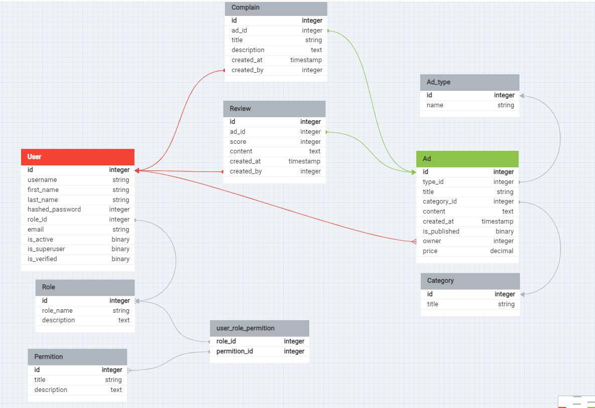

Техническая документация
=========================

Тестовое задание на позицию Python-разработчика.
--------------------------  

## **Общее описание программы**

Настоящий документ предназначен для ознакомления пользователя с функциональными возможностями написанной программы в рамках выполнения тестового задания для **стажировки** в компании **Surf IT** на позицию **Python-разработчика**.

Программа служит для реализации **REST API** сервера, который предоставляет сервис по размещению объявлений. Объявления могут быть разных видов (продажа, покупка, оказание услуг).

**Выполнил задание:** Цыденов Саян Баирович


## Технологический стэк: 
`Python 3.11, FastAPI, PostgreSQL 15.3, SQLAlchemy(async), alembic, fastapi-users, loguru, aiogram`


## Перечень выполненных заданий:
Основные возможности пользователя:
- [x] Регистрация
- [x] Вход в систему
- [x] Размещение объявления
- [x] Просмотр списка объявлений
- [x] Детальный просмотр одного объявления
- [x] Удаление своего объявления

Основные возможности администратора:
- [x] Все выше перечисленное
- [x] Удаление обзоров в любой группе объявлений
- [x] Назначение пользователя администратором

Дополнительные задания
- [x] Подробное описание выполненного задания в README.md
- [x] Наличие OPEN API файла
- [x] Соответствие REST API
- [x] Наличие файла зависимостей "requirements.txt"
- [x] Сборка проекта в докер-образ
- [x] Серверная пагинация
- [x] Фильтрация объявлений (по категории, типу, цене, дате публикации)
- [x] Сортировка записей (по дате публикации, по цене)
- [x] Авторизация с помощью JWT-токена
- [x] Жалоба на объявление
- [x] Отзыв на размещенное объявление
- [x] Просмотр администратором жалоб на объявления
- [x] Бан/разбан пользователя администратором
- [x] Перемещение объявлений из одной группы в другую (с помощью эндпоинта edit_ad)
- [x] Настройка логгирования проекта
- [x] При критических ошибках отправляется уведомление об этой ошибке в телеграмм чат
- [ ] Хранение сессии пользователя в Redis

# Инструкция по развертыванию:
1. Запустить команду
```
docker-compose up
```
2. Готово! Вы восхитительны!

# Подробнее о проекте

Для получения доступа к API через встроенную автодокументацию можно перейти по адресу `localhost:8042/docs`

- логин администратора: admin
- пароль администратора: admin

## База данных
Для взаимодействия с базой данных использована библиотека **SQLAlchemy** и асинхронный движок **asyncpg**.

Для фиксирования изменения структуры базы данных по метаданным из кода Python была внедрена библиотека **alembic**.

Дополнительные индексы для базы данных не были задействованы, поскольку функционал этого не требует.

Поскольку проект является лишь тестовым заданием, все данные базы хранятся локально и не были задеплоины в облачных сервисах. Конфигурация лежит в docker-compose.yml и db/db_config.ini, секретный пароль не скрывался.



## Авторизация и аутентификация
Для этого была использована библиотека fastapi-users.

Роли расписаны в простейшем варианте с возможностью последующего расширения. Для сокращения количества запросов можно хранить в базе только id и разметить роли в перечислении внутри приложения или же сделать кэширование.

## Логирование
Телеграм бот в проект не подключен, для подключения необходимо добавить в файл "./log/logger.py" TOKEN и CHAT_ID.

Логирование происходит с помощью loguru с *retention* в 10 дней и максимальным объемом в 5 мегабайт.

## Git

Git коммиты не являются атомарными в данном проекте, то есть каждый коммит содержит не единственное действие по внесению изменения в кодовую базу. Это связано с простотой проекта.

# API Endpoints
## Объявления

### Создание объявления.
`POST /ad/create`

**Входные параметры** (объект AdBase):
- `type_id`: ID типа объявления (1: продажа, 2: покупка, 3: услуга)
- `title`: Заголовок объявления (по умолчанию 'New ad')
- `category_id`: ID категории объявления (не обязательно)
- `content`: Содержание объявления
- `is_published`: Опубликовано ли объявление (по умолчанию True)
- `owner`: ID владельца объявления
- `price`: Цена объявления
- `created_at`: Дата создания объявления

**Возвращает**: Созданный объект объявления.

**Права доступа**: Авторизированный пользователь

---
### Получение списка объявлений с возможностью фильтрации и сортировки.
`POST /ad/list`
**Входные параметры** (объект `AdListQuery`):
- `page`: Номер страницы (по умолчанию 1)
- `per_page`: Количество объявлений на страницу (по умолчанию 10, не больше 100)
- `categories`: Список ID категорий для фильтрации
- `ad_type`: Тип объявления для фильтрации
- `sort`: Параметр для сортировки ('created_at', '-created_at', 'price', '-price')
- `creation_time_interval`: Интервал времени создания объявления (`older_then` и `newer_then`)
- `price_interval`: Интервал цены (`price_gt` и `price_lt`)

**Возвращает**: Список объявлений.

**Права доступа**: Неавторизированный пользователь

---
### Получение детальной информации об объявлении.
`GET /ad/{ad_id}/get/`

**Входные параметры**: ID объявления.

**Возвращает**: Объект объявления.

**Права доступа**: Неавторизированный пользователь

---
### Редактирование объявления.
`POST /ad/{ad_id}/edit`
**Входные параметры** (объект `AdEdit` и ID объявления):
- `type_id`: ID типа объявления
- `title`: Заголовок объявления
- `category_id`: ID категории объявления
- `content`: Содержание объявления
- `is_published`: Опубликовано ли объявление
- `owner`: ID владельца объявления
- `price`: Цена объявления

**Возвращает**: Обновленный объект объявления.

**Права доступа**: Пользователь или администратор для чужих объявлений

---
### Удаление объявления.
`DELETE /ad/{ad_id}/delete/`

**Входные параметры**: ID объявления.

**Возвращает**: Сообщение об успешном удалении.

**Права доступа**: Пользователь или администратор для чужих объявлений

---
## Жалобы на объявление
### Создание жалобы на объявление.
`POST /ad/complains/create`
**Входные параметры** (объект `ComplainBase`):
- `ad_id`: ID объявления
- `title`: Заголовок жалобы
- `description`: Описание жалобы
- `created_by`: ID создателя жалобы
- `created_at`: Дата создания жалобы

**Возвращает**: Созданный объект жалобы.

**Права доступа**: Пользователь

---
### Получение списка жалоб на объявление.
`GET /ad/complains/list/{ad_id}/`

**Входные параметры**: ID объявления.

**Возвращает**: Список жалоб.

**Права доступа**: Администратор

---
## Отзывы на объявление
### Создание отзыва на объявление.
`POST /ad/review/create/`
**Входные параметры** (объект `ReviewBase`):
- `ad_id`: ID объявления
- `score`: Оценка отзыва (от 0 до 10, по умолчанию 5)
- `content`: Содержание отзыва
- `created_by`: ID создателя отзыва
- `created_at`: Дата создания отзыва

**Возвращает**: Созданный объект отзыва.

**Права доступа**: Пользователь

---
### Получение списка отзывов на объявление.
`GET /ad/{ad_id}/review/list`

**Входные параметры**: ID объявления.

**Возвращает**: Список отзывов.

**Права доступа**: Неавторизированный пользователь

---
### Удаление отзыва.
`DELETE /ad/reviews/{review_id}`

**Входные параметры**: ID отзыва.

**Возвращает**: Сообщение об успешном удалении.

**Права доступа**: Пользователь или администратор для чужих объявлений

---

## Администрирование

### Назначение пользователя суперпользователем.
`POST /auth/make_superuser`

**Входные параметры**: `user_to_admin` - ID пользователя для назначения суперпользователем.

**Возвращает**: Объект пользователя с обновленным статусом.

**Права доступа**: **Администратор**

---
### Бан пользователя.
`POST /auth/ban_user`

**Входные параметры**: `user_to_ban` - ID пользователя для бана.

**Возвращает**: Объект пользователя с обновленным статусом.

**Права доступа**: **Администратор**


---
### Снятие бана с пользователя.
`POST /auth/unban_user`

**Входные параметры**: `user_to_ban` - ID пользователя для снятия бана.

**Возвращает**: Объект пользователя с обновленным статусом.

**Права доступа**: **Администратор**