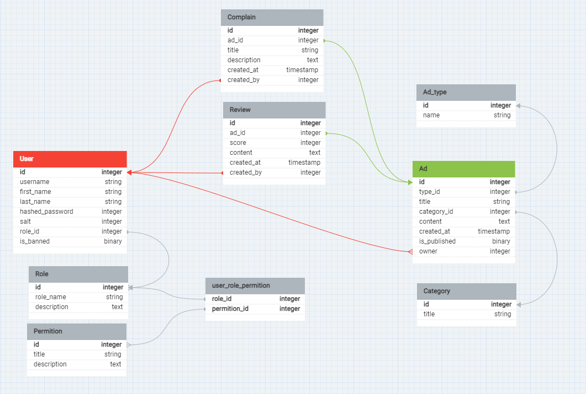

Техническая документация
=========================

Тестовое задание на позицию Python-разработчика.
--------------------------  

## **Общее описание программы**

Настоящий документ предназначен для ознакомления пользователя с функциональными возможностями написанной программы в рамках выполнения тестового задания для **стажировки** в компании **Surf IT** на позицию **Python-разработчика**.

Программа служит для реализации **REST API** сервера, который предоставляет сервис по размещению объявлений. Объявления могут быть разных видов (продажа, покупка, оказание услуг).

**Выполнил задание:** Цыденов Саян Баирович


## Технологический стэк: 
`Python 3.11, FastAPI, PostgreSQL 15.3, SQLAlchemy(async), alembic, fastapi-users, loguru, aiogram`


## Перечень выполненных заданий:
Основные возможности пользователя:
- [x] Регистрация
- [x] Вход в систему
- [x] Размещение объявления
- [x] Просмотр списка объявлений
- [x] Детальный просмотр одного объявления
- [x] Удаление своего объявления

Основные возможности администратора:
- [x] Все выше перечисленное
- [x] Удаление обзоров в любой группе объявлений
- [x] Назначение пользователя администратором

Дополнительные задания
- [x] Подробное описание выполненного задания в README.md
- [x] Наличие OPEN API файла
- [x] Соответствие REST API
- [x] GIT-flow
- [x] Наличие файла зависимостей "requirements.txt"
- [x] Сборка проекта в докер-образ
- [x] Серверная пагинация
- [x] Фильтрация объявлений (по категории, типу, цене, дате публикации)
- [x] Сортировка записей (по дате публикации, по цене)
- [x] Авторизация с помощью JWT-токена
- [x] Жалоба на объявление
- [x] Отзыв на размещенное объявление
- [x] Просмотр администратором жалоб на объявления
- [x] Бан/разбан пользователя администратором
- [x] Перемещение объявлений из одной группы в другую (с помощью эндпоинта edit_ad)
- [x] Настройка логгирования проекта
- [x] При критических ошибках отправляется уведомление об этой ошибке в телеграмм чат
- [ ] Хранение сессии пользователя в Redis

# Инструкция по развертыванию:
1. Запустить команду
```
docker-compose up
```
2. Готово! Вы восхитительны!серверах.

# Подробнее о проекте

Для получения доступа к API через встроенную автодокументацию можно перейти по адресу `0.0.0.0:8042/docs`

- логин администратора: admin
- пароль администратора: admin

## База данных
Для взаимодействия с базой данных использована библиотека **SQLAlchemy** и асинхронный движок **asyncpg**.

Для фиксирования изменения структуры базы данных по метаданным из кода Python была внедрена библиотека **alembic**.

Дополнительные индексы для базы данных не были задействованы, поскольку функционал этого не требует.

Поскольку проект является лишь тестовым заданием, все данные базы хранятся локально и не были задеплоины в облачных сервисах. Конфигурация лежит в docker-compose.yml и db/db_config.ini, секретный пароль не скрывался.



## Авторизация и аутентификация
Для этого была использована библиотека fastapi-users.

Роли расписаны в простейшем варианте с возможностью последующего расширения. Для сокращения количества запросов можно хранить в базе только id и разметить роли в перечислении внутри приложения или же сделать кэширование.

## Логирование
Телеграм бот в проект не подключен, для подключения необходимо добавить в файл "./log/logger.py" TOKEN и CHAT_ID.

Логирование происходит с помощью loguru с *retention* в 10 дней и максимальным объемом в 5 мегабайт.

## Git

Git коммиты не являются атомарными в данном проекте, то есть каждый коммит содержит не единственное действие по внесению изменения в кодовую базу. Это связано с простотой проекта.
